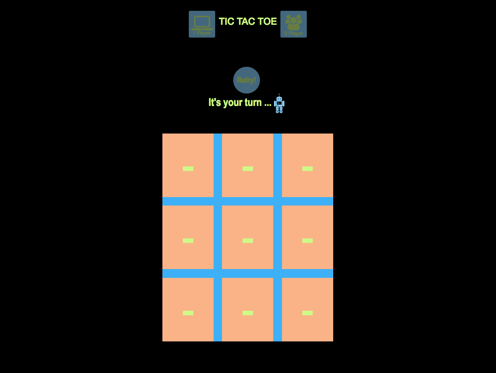
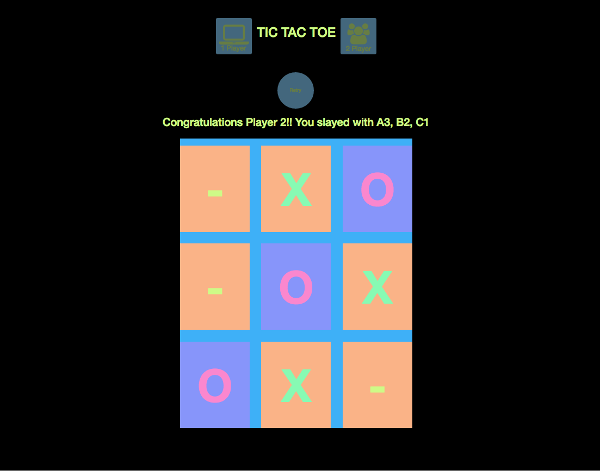

#TicTacToe Game using a miniMax Algorithm!

##Angular.js, HTML, miniMax, and SASS

###LINK to project

www.dannyarango.com/tictactoe

###Overview of Project
A simple Tic-Tac-Toe game in which you can play either against a friend or against the computer.  I used a miniMax function for the computer's AI and then manipulated it so that you could play against three levels of "Intelligence."  The Two Player side of the app is built completely using vanilla JavaScript and the AI half is built using jQuery!  

###Built With

Angular
Bootstrap
Javascript
HTML
CSS
D3

###NPMs

npm install angular
npm install angular-cookies
npm install jquery
npm install angular-animate
npm install angular-route
npm install boostrap

###SCREENSHOTS

###Things to add

*Would like to use the soloCtrl to power both the Single and Duo games and use the computers miniMax function to create "hints" as to what the best move would be!

### Contributors

*Danny Arango: http://www.dannyarango.com

